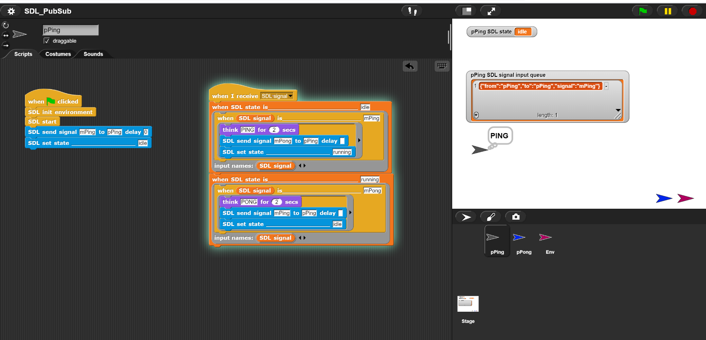

# SDL4Snap *!*

SDL4Snap *!*  is a Snap *!*  library with a minimal implementation of the SDL modeling language [SDL](http://www.sdl-forum.org/SDL) in [Snap *!*](http://snap.berkeley.edu) and [Snap4Arduino](http://snap4arduino.rocks).

## Running an example

The PingPong example can be considered the "Hello World" of a SDL based multi-agent system. A running example of it can be found [here](https://snap.berkeley.edu/snap/snap.html#open:https://raw.githubusercontent.com/pixavier/sdl4snap/master/examples/SDL2Snap-PingPong.xml).  

## Usage and blocks

If you want just load the SDL4Snap *!* blocks library, select and copy the following URL into the clipboard, and then paste it into the file/URL Snap *!*  import pop-up textfield:

    https://raw.githubusercontent.com/pixavier/sdl4snap/master/sdl-standalone.xml

##
Here you can see the blocks and a simple example to test:
###

### SDL start block

The SDL blocks are suitable for PubSub architecture based implementations.

## Acknowledgents

This project wouldn't exist without:

- [MQTT4Snap!](https://github.com/pixavier/mqtt4snap)

