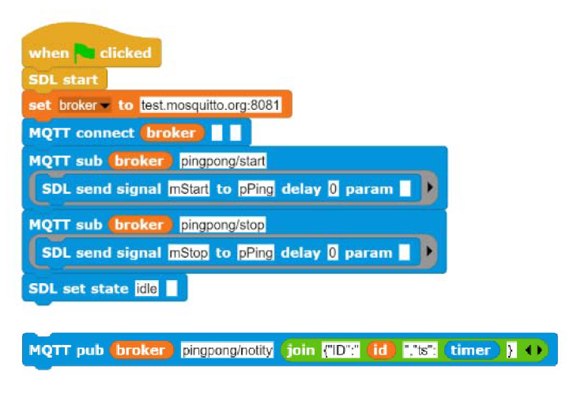

# SDL4Snap *!*

SDL4Snap *!*  is a Snap *!*  library with a minimal implementation of the modeling [Specification and Description Language (SDL)](http://www.sdl-forum.org/SDL) in [Snap *!*](http://snap.berkeley.edu) and [Snap4Arduino](http://snap4arduino.rocks).

Yoy can find an introduction to SDL [here](https://raw.githubusercontent.com/pixavier/sdl4snap/master/docs/SpecificationAndDescriptionLanguageForDiscreteSimulation.pdf), a tutorial (vintage) [here](https://www.sdl-forum.org/sdl88tutorial/index.html), and an introduction to modeling with SDL [here](https://raw.githubusercontent.com/pixavier/sdl4snap/master/docs/SimulationModelsFormalization.pdf).

## Try it at: [Hello World!](https://snap.berkeley.edu/snap/snap.html#open:https://raw.githubusercontent.com/pixavier/sdl4snap/master/examples/SDL2Snap-PingPong.xml)

### (JavaScript extensions must be ticked)

The PingPong example can be considered the ["Hello World"](https://en.wikipedia.org/wiki/%22Hello,_World!%22_program) of a SDL based multi-agent system. An online runnable example can be found [here](https://snap.berkeley.edu/snap/snap.html#open:https://raw.githubusercontent.com/pixavier/sdl4snap/master/examples/SDL2Snap-PingPong_local.xml).  

## PingPong SDL model

To import the PingPong SDL model into [UMLetino](https://www.umletino.com), copy the following URL to the clipboard, and then paste it when "File Import":

    https://raw.githubusercontent.com/pixavier/sdl4snap/master/examples/PingPong_SDL.uxf

If you only want to import the SDL palette into [UMLetino](https://www.umletino.com), copy the following URL to the clipboard, and then paste it when "File Import":

    https://raw.githubusercontent.com/pixavier/sdl4snap/master/palette/SDL_palette.uxf

## Usage and blocks

Start from the HelloWorld example, and delete the blocks you will not use. Each agent (sprite) has some atributes (local variables) that are needed by the SDL engine, such as "SDL signal input queue" and "SDL state".

To create new processes, duplicate a similar one instead creating it from scratch.

##
Here you can see the Snap *!* translation of the PingPong example:
###

### Using PubSub architecture to support distributed messaging

The scheme of processes communication is described in the classic SDL Forum [SDL-88 Tutorial](https://www.sdl-forum.org/sdl88tutorial/4.ProcessCommunication/4.1_Signal_input_queue.htm) SDL Tutorial, as it is shown in the following picture:
 

SDL4Snap *!* can use MQTT to support distributed messaging over a network. The [MQTT4Snap *!*](https://github.com/pixavier/mqtt4snap) extension lets send/receive messages via the MQTT protocol, hence agents (blocks and processes) can run distributed among Snap *!* Internet-connected browsers. MQTT4Snap *!* "pub" and "sub" blocks, combined to the "send signal" block, as depicted in the following image:

[MQTT](https://en.wikipedia.org/wiki/MQTT) based systems can be combined with other protocols like [HTTP-REST](https://en.wikipedia.org/wiki/Representational_state_transfer) or [OPC-UA](https://opcfoundation.org/resources/brochures) with another no/low-code tools like [Node-RED](https://nodered.org).

SDL4Snap *!*  was [presented](https://www.youtube.com/watch?v=SW-g62MUu2g) in the [Snap!con 2021](https://www.snapcon.org/conferences/2021/program/proposals/276) Conference.

SDL4Snap *!*  was presented in the [SAM 2021 (MODELS 2021)](https://sdl-forum.org/Events/SAM2021/acceptedpapers.htm) Conference, with the paper ["Combining Low-Code Programming and SDL-Based Modeling with Snap! in the Industry 4.0 Context"](https://www.researchgate.net/publication/355183965_Combining_Low-Code_Programming_and_SDL-Based_Modeling_with_Snap_in_the_Industry_40_Context).

