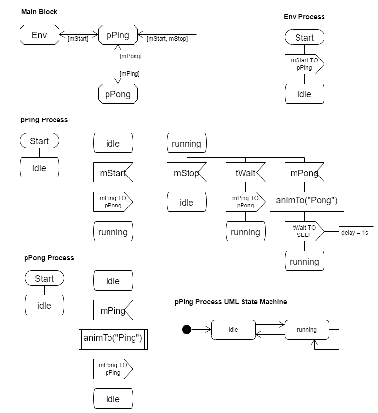
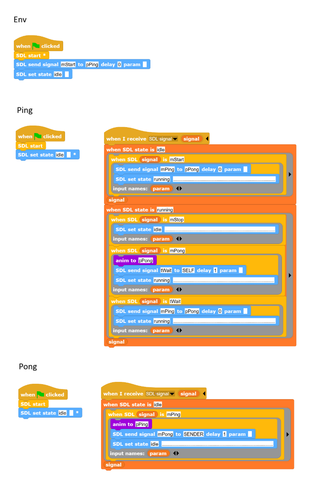
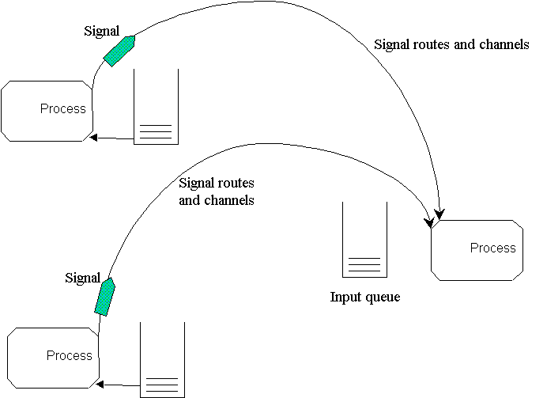
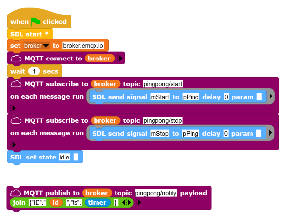

# SDL4Snap *!*

SDL4Snap *!*  is a [Snap *!*  library](https://xavierpi.com/ejemplos/sdl4snap2.xml) with a minimal implementation of the modeling [Specification and Description Language (SDL)](https://www.sdl-forum.org/languages/sdl.php) in [Snap *!*](http://snap.berkeley.edu).

Yoy can find an introduction to SDL [here](https://raw.githubusercontent.com/pixavier/sdl4snap/master/docs/SpecificationAndDescriptionLanguageForDiscreteSimulation.pdf), a tutorial (vintage) [here](https://www.sdl-forum.org/sdl88tutorial/index.html), an introduction to modeling with SDL [here](https://raw.githubusercontent.com/pixavier/sdl4snap/master/docs/SimulationModelsFormalization.pdf), and a minimal SDL mono-agent model [here](https://snap.berkeley.edu/snap/snap.html#open:https://raw.githubusercontent.com/pixavier/sdl4snap/master/examples/SDL_min2.xml).

## Try it at: [Hello World!](https://snap.berkeley.edu/snap/snap.html#open:https://raw.githubusercontent.com/pixavier/sdl4snap/master/examples/SDL2Snap-PingPong2.xml)

### [Hello World! - Previous version](https://snap.berkeley.edu/snap/snap.html#open:https://raw.githubusercontent.com/pixavier/sdl4snap/master/examples/SDL2Snap-PingPong2.xml)

The PingPong example, inspired by the [Pragmadev Ping Pong example](img/ping_pong_pragmadev.png), can be considered the ["Hello World"](https://en.wikipedia.org/wiki/%22Hello,_World!%22_program) of a SDL multi-agent system. 

## PingPong SDL model

To import the PingPong SDL model into [UMLetino](https://www.umletino.com), copy the following URL to the clipboard, and then paste it when "File Import":

    https://raw.githubusercontent.com/pixavier/sdl4snap/master/examples/PingPong_SDL.uxf

If you only want to import the SDL palette into [UMLetino](https://www.umletino.com), copy the following URL to the clipboard, and then paste it when "File Import":

    https://raw.githubusercontent.com/pixavier/sdl4snap/master/palette/SDL_palette.uxf

## Usage and blocks

Start from the HelloWorld example, and delete the blocks you will not use. Each agent (sprite) has attributes (local variables) that the SDL engine needs, such as "SDL state". The approach is a systematic translation of SDL into a programming language, as in the early days ([Saracco](https://raw.githubusercontent.com/pixavier/sdl4snap/master/docs/Saracco_The_CCITT_SpecificationAndDescriptionLanguage.pdf)) and more recently ([Trossen](https://raw.githubusercontent.com/pixavier/sdl4snap/master/docs/Trossen_FrameworkForAutomatic_SDL_to_C++_Translation.pdf)) and [Sanders](https://raw.githubusercontent.com/pixavier/sdl4snap/master/docs/Sanders_ImplementingFromSDL.pdf)).

To create new processes, duplicate a similar one instead creating it from scratch.

##
Here you can see the Snap *!* translation of the PingPong example:
###

### Starred blocks

In the previous example, we can see two blocks that we can call starred: the **“SDL start”** block and the **“SDL set state”** block. If we have multiple starting threads (green flags), the starred **“SDL start”** block should appear in only one of them, since it performs general system initialization; duplicating it can cause problems. On the other hand, there are the starred **“SDL set state”** blocks, in which case the logic is the opposite: there can only be one unstarred block in the starting threads (green flags), whereas in the rest of the model, all of them must be unstarred, since they pull and shoot the following event from the signals queue.

### Statistics library

SDL4Snap *!* can be combined with a statistics lib like [this](https://xavierpi.com/ejemplos/StatisticsLib.xml), that can be included with File->Import.
Note that this library needs to activate the Snap *!* JavaScript Extensions.

### Using PubSub architecture to support distributed messaging

The scheme of processes communication is described in the classic SDL Forum [SDL-88 Tutorial](https://www.sdl-forum.org/sdl88tutorial/4.ProcessCommunication/4.1_Signal_input_queue.htm) SDL Tutorial, as it is shown in the following picture:
 

SDL4Snap *!* can use MQTT to support distributed messaging over a network. The [MQTT4Snap *!*](https://github.com/pixavier/mqtt4snap) extension lets send/receive messages via the MQTT protocol, hence agents (blocks and processes) can run distributed among Snap *!* Internet-connected browsers. MQTT4Snap *!* "pub" and "sub" blocks, combined to the "send signal" block, as depicted in the following image:

[MQTT](https://www.hivemq.com/info/mqtt-essentials/) based systems can be combined with other protocols like [HTTP](https://www.geeksforgeeks.org/blogs/http-full-form/) or [OPC-UA](https://opcfoundation.org/resources/brochures) with another no/low-code tools like [Node-RED](https://nodered.org).

SDL4Snap *!*  was [presented (video)](https://www.youtube.com/watch?v=SW-g62MUu2g) in the [Snap!con 2021](https://www.snapcon.org/conferences/2021/program/proposals/276) Conference.

SDL4Snap *!*  was presented in the [SAM 2021 (MODELS 2021)](https://sdl-forum.org/Events/SAM2021/acceptedpapers.htm) Conference, with the paper ["Combining Low-Code Programming and SDL-Based Modeling with Snap! in the Industry 4.0 Context"](https://ieeexplore.ieee.org/document/9643622), indexed in the [UPC repository](https://upcommons.upc.edu/entities/publication/d7b6214f-bd17-419b-b7b6-4bd8d21b0f12).

Classic examples like MM2 queues can be implemented with SDL4Snap *!*. [Here](https://sdlps.com/Experiments/ModelDocsPng/2025) is the specification, and [here](https://snap.berkeley.edu/snap/snap.html#open:https://raw.githubusercontent.com/pixavier/sdl4snap/master/examples/MM2.xml) is the implementation. There is also a version with a low-code panel and an AI generated visualization ApexCharts based panel [here](https://xavierpi.com/mm2) ([video](https://raw.githubusercontent.com/pixavier/sdl4snap/master/docs/sdl4snap_mm2.mp4
)). 

They are other online diagram tools like [diagrams.net](https://app.diagrams.net) (formerly draw.io), that can be used with examples like [this](https://sdlps.com/Experiments/ModelDocsPng/2025).
