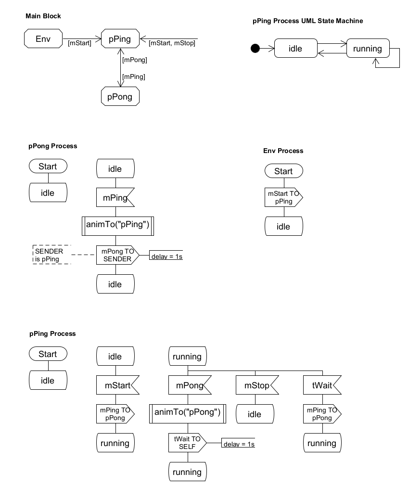

# SDL4Snap *!*

SDL4Snap *!*  is a Snap *!*  library with a minimal implementation of the SDL modeling language [SDL](http://www.sdl-forum.org/SDL) in [Snap *!*](http://snap.berkeley.edu) and [Snap4Arduino](http://snap4arduino.rocks).

## Hello World!

The PingPong example can be considered the "Hello World" of a SDL based multi-agent system. An online runnable example can be found [here](https://snap.berkeley.edu/snap/snap.html#open:https://raw.githubusercontent.com/pixavier/sdl4snap/master/examples/SDL2Snap-PingPong.xml).  
Local messages version is also available [here](https://snap.berkeley.edu/snap/snap.html#open:https://raw.githubusercontent.com/pixavier/sdl4snap/master/examples/SDL2Snap-PingPong_local.xml)

## PingPong SDL model

[UMLetino](https://www.umletino.com) file of the SDL model is downloadable (Save as ...) [here](https://raw.githubusercontent.com/pixavier/sdl4snap/master/examples/PingPong_SDL.uxf).

## Usage and blocks

If you want just load the SDL4Snap *!* blocks library, select and copy the following URL into the clipboard, and then paste it into the file/URL Snap *!*  import pop-up textfield:

    https://raw.githubusercontent.com/pixavier/sdl4snap/master/sdl-standalone.xml

##
Here you can see the Snap *!* translation of the PingPong example.
###

<!--   -->

### Using PubSub architecture to support distributed messaging

The scheme of processes communication is described in the classic SDL Forum [SDL-88 Tutorial](https://www.sdl-forum.org/sdl88tutorial/4.ProcessCommunication/4.1_Signal_input_queue.htm) SDL Tutorial.
SDL4Snap *!* uses MQTT as the base mechanism to support distributed messaging. The [MQTT4Snap *!*](https://github.com/pixavier/mqtt4snap) extension has been used for this purpose. With SDL4Snap *!*, agents (blocks and processes) can run distributed among Snap *!* Internet connected browsers.  
 

